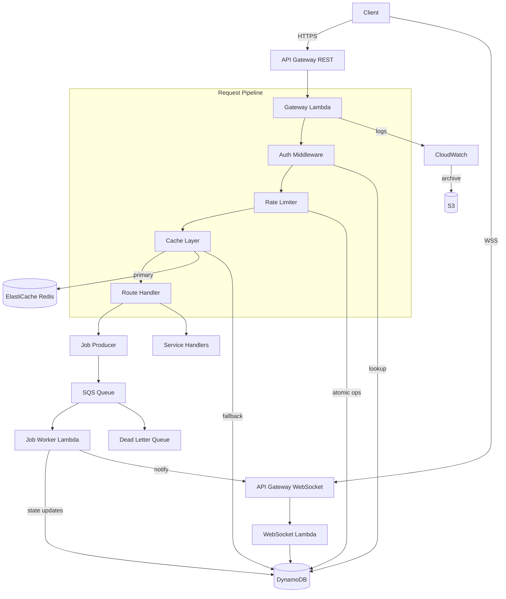
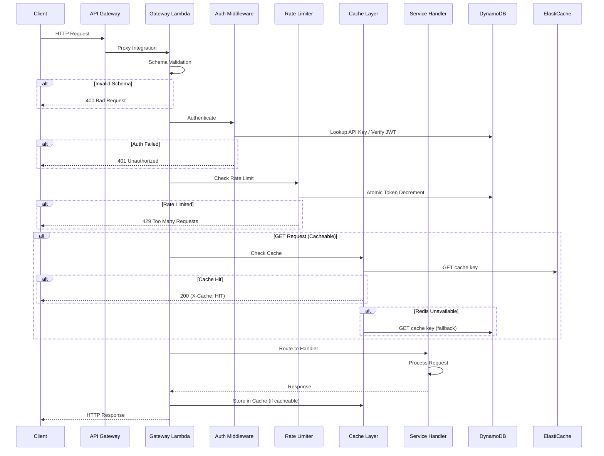
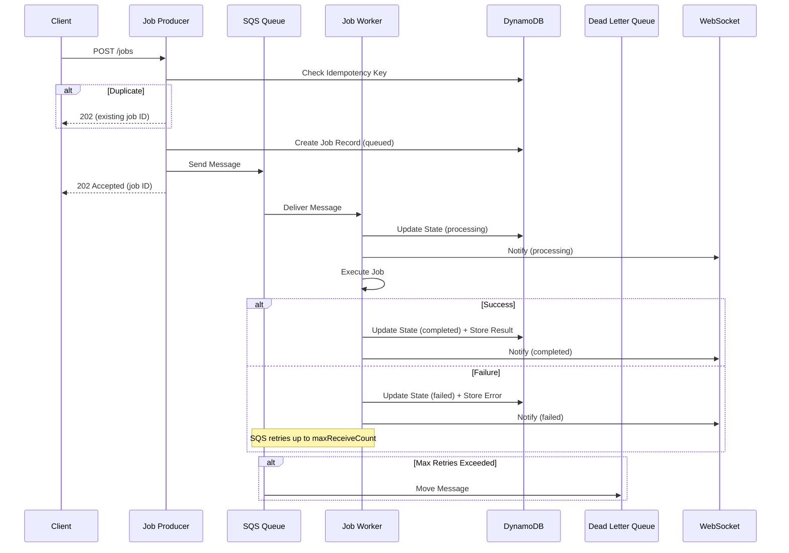
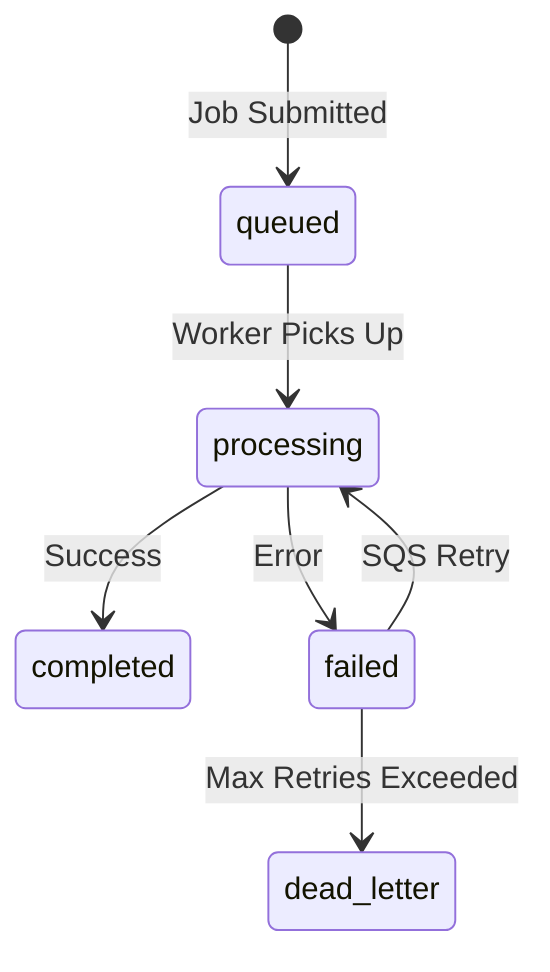

# Design Document: Dev Infrastructure Platform

## Overview

The Dev Infrastructure Platform is a modular, serverless backend platform built on AWS that provides a unified API gateway, authentication, rate limiting, caching, asynchronous job processing, and observability. The platform is designed as a set of composable layers that process requests through a well-defined pipeline, with each layer responsible for a single concern.

### Key Design Decisions

1. **Single Lambda entry point**: All HTTP requests flow through a single Gateway Lambda that orchestrates the middleware pipeline. This simplifies deployment and keeps routing logic centralized, at the cost of cold-start latency for the single function. The alternative (per-route Lambdas) was rejected because it fragments middleware logic and complicates cross-cutting concerns like auth and rate limiting.

2. **DynamoDB for state, Redis for speed**: DynamoDB serves as the durable state store for rate limit counters, job records, and cache fallback. ElastiCache Redis provides low-latency caching. This dual-store approach gives us both durability and performance without coupling to a single technology.

3. **Token bucket in DynamoDB with conditional writes**: Rate limiting uses DynamoDB atomic conditional updates to implement the token bucket algorithm. This avoids the need for a separate Redis-based rate limiter and keeps the rate limiting layer operational even if Redis is unavailable.

4. **SQS for job queuing with DLQ**: SQS provides reliable, at-least-once delivery for async jobs. A dead-letter queue captures messages that exceed the retry limit. This is simpler and more cost-effective than Step Functions for straightforward job processing.

5. **WebSocket API Gateway for real-time updates (optional)**: When enabled, a separate WebSocket API Gateway allows clients to subscribe to job state changes. Connection IDs are stored in DynamoDB and used by the Job Worker to push updates.

### Technology Stack

| Component | Technology |
|---|---|
| API Gateway | AWS API Gateway (REST) |
| Compute | AWS Lambda (Node.js/TypeScript) |
| State Store | Amazon DynamoDB (on-demand) |
| Cache | Amazon ElastiCache Serverless (Redis) |
| Job Queue | Amazon SQS (Standard) |
| Dead Letter Queue | Amazon SQS |
| Logging | Amazon CloudWatch Logs |
| Log Archive | Amazon S3 |
| Metrics | Amazon CloudWatch Metrics |
| Real-time (optional) | AWS API Gateway (WebSocket) |
| IaC | AWS CDK (TypeScript) |

## Architecture

### High-Level Architecture



### Request Flow



### Job Processing Flow



## Components and Interfaces

### 1. Gateway Lambda

The central request handler that orchestrates the middleware pipeline.

**Interface:**
```typescript
// Gateway Lambda handler
interface GatewayEvent {
  httpMethod: string;
  path: string;
  headers: Record<string, string>;
  body: string | null;
  queryStringParameters: Record<string, string> | null;
  requestContext: {
    identity: {
      sourceIp: string;
    };
  };
}

interface GatewayResponse {
  statusCode: number;
  headers: Record<string, string>;
  body: string;
}

// Route definition
interface RouteDefinition {
  method: string;
  path: string;       // e.g., "/jobs", "/jobs/{id}"
  handler: RouteHandler;
  cacheable: boolean;
  cacheTtlSeconds?: number;
  rateLimitOverride?: RateLimitConfig;
  requiresAuth: boolean;
}

type RouteHandler = (context: RequestContext) => Promise<GatewayResponse>;
```

**Responsibilities:**
- Parse and validate incoming requests against JSON schema
- Execute middleware pipeline: Auth → Rate Limit → Cache → Route
- Match request to route definition
- Return structured error responses for validation failures (400) and unknown routes (404)
- Assign correlation ID to each request
- Log request/response metadata

### 2. Auth Middleware

Validates API keys and JWT tokens, attaching identity to the request context.

**Interface:**
```typescript
interface AuthResult {
  authenticated: boolean;
  identity: {
    userId: string;
    applicationId: string;
    authMethod: 'api-key' | 'jwt';
    claims?: Record<string, unknown>;  // JWT claims when using JWT auth
  } | null;
  error?: string;
}

interface AuthMiddleware {
  authenticate(request: GatewayEvent): Promise<AuthResult>;
}

// Request context enriched by auth
interface RequestContext {
  correlationId: string;
  sourceIp: string;
  identity: AuthResult['identity'];
  httpMethod: string;
  path: string;
  headers: Record<string, string>;
  body: unknown;
  queryParams: Record<string, string>;
  timestamp: number;
}
```

**Design Notes:**
- API keys are stored in DynamoDB with associated user/application metadata
- JWT verification uses a cached public key set (JWKS) to avoid repeated fetches
- The middleware checks for `x-api-key` header first, then `Authorization: Bearer <token>`
- Both auth methods resolve to the same `identity` shape for downstream uniformity

### 3. Rate Limiter

Implements token bucket rate limiting with DynamoDB as the backing store.

**Interface:**
```typescript
interface RateLimitConfig {
  tokensPerWindow: number;
  windowSizeSeconds: number;
  burstLimit: number;
}

interface RateLimitResult {
  allowed: boolean;
  remaining: number;
  retryAfterSeconds?: number;
  limit: number;
}

interface RateLimiter {
  checkAndConsume(
    userId: string,
    sourceIp: string,
    applicationId: string,
    endpoint?: string
  ): Promise<RateLimitResult>;
}
```

**Token Bucket Algorithm (DynamoDB Implementation):**

The token bucket is implemented using a single DynamoDB item per rate limit key. Each item stores the current token count and the last refill timestamp. On each request:

1. Read the current bucket state
2. Calculate tokens to add based on elapsed time since last refill: `tokensToAdd = floor((now - lastRefill) / windowSize) * tokensPerWindow`
3. Cap tokens at `burstLimit`
4. If tokens > 0, decrement by 1 using a DynamoDB conditional update (`ConditionExpression: tokens > 0`)
5. If the conditional write fails (race condition), retry once
6. If tokens = 0, reject with `Retry-After` header

The conditional write ensures atomicity without distributed locks. The refill calculation is lazy — tokens are computed on read rather than by a background process (satisfies Requirement 3.6).

### 4. Cache Layer

Provides read-through caching with Redis primary and DynamoDB fallback.

**Interface:**
```typescript
interface CachedResponse {
  statusCode: number;
  headers: Record<string, string>;
  body: string;
  cachedAt: number;
  ttl: number;
}

interface CacheLayer {
  get(key: string, applicationId: string): Promise<CachedResponse | null>;
  set(key: string, applicationId: string, response: CachedResponse, ttlSeconds: number): Promise<void>;
  invalidate(key: string, applicationId: string): Promise<void>;
  invalidatePattern(pattern: string, applicationId: string): Promise<void>;
}
```

**Design Notes:**
- Cache keys are namespaced by application ID: `{applicationId}:{endpoint}:{queryHash}`
- Redis is the primary store; on connection failure, the layer transparently falls back to DynamoDB
- DynamoDB TTL is used for automatic expiration of fallback cache entries
- Pattern-based invalidation uses Redis `SCAN` with `MATCH` for the primary store and a DynamoDB GSI on the key prefix for the fallback store
- The `X-Cache` response header indicates `HIT` or `MISS`
- Cache serialization preserves the full response structure (status code, headers, body) as JSON

### 5. Job Producer

Accepts job submissions, enforces idempotency, and enqueues to SQS.

**Interface:**
```typescript
interface JobSubmission {
  type: string;
  payload: Record<string, unknown>;
  idempotencyKey?: string;
  priority?: 'normal' | 'high';
}

interface JobRecord {
  jobId: string;
  applicationId: string;
  type: string;
  payload: Record<string, unknown>;
  state: 'queued' | 'processing' | 'completed' | 'failed';
  idempotencyKey?: string;
  result?: Record<string, unknown>;
  error?: { message: string; code: string; retryCount: number };
  createdAt: number;
  updatedAt: number;
}

interface JobProducer {
  submit(submission: JobSubmission, context: RequestContext): Promise<{ jobId: string; status: 'created' | 'existing' }>;
}
```

**Idempotency Design:**
- When an `idempotencyKey` is provided, the producer queries a DynamoDB GSI on `(applicationId, idempotencyKey)`
- If a matching job exists, the existing job ID is returned without creating a duplicate
- Idempotency keys expire after 24 hours (DynamoDB TTL) to prevent unbounded growth

### 6. Job Worker

Processes jobs from SQS, manages state transitions, and publishes real-time updates.

**Interface:**
```typescript
interface JobWorker {
  processMessage(sqsMessage: SQSMessage): Promise<void>;
}

// Job type registry
interface JobTypeHandler {
  execute(payload: Record<string, unknown>, context: JobExecutionContext): Promise<Record<string, unknown>>;
  validate(payload: Record<string, unknown>): boolean;
}

interface JobExecutionContext {
  jobId: string;
  applicationId: string;
  correlationId: string;
  attemptNumber: number;
}
```

**State Machine:**


### 7. Request Logger

Structured logging and metrics emission.

**Interface:**
```typescript
interface LogEntry {
  correlationId: string;
  timestamp: string;
  level: 'INFO' | 'WARN' | 'ERROR';
  applicationId: string;
  httpMethod: string;
  path: string;
  sourceIp: string;
  userId?: string;
  statusCode: number;
  latencyMs: number;
  error?: {
    message: string;
    stack?: string;
    code?: string;
  };
}

interface RequestLogger {
  logRequest(entry: LogEntry): void;
  logError(entry: LogEntry & { error: NonNullable<LogEntry['error']> }): void;
  emitMetrics(entry: LogEntry): void;
  flush(): Promise<void>;
}
```

**Design Notes:**
- Logs are written as structured JSON to CloudWatch Logs
- S3 archival uses CloudWatch Logs subscription filters to stream to Kinesis Firehose, which delivers to S3 partitioned by `year/month/day`
- Metrics are emitted via CloudWatch Embedded Metric Format (EMF) for zero-cost custom metrics
- If CloudWatch write fails, entries are buffered in-memory and retried with exponential backoff (max 3 retries within the Lambda execution)

### 8. WebSocket Handler (Optional)

Manages WebSocket connections for real-time job updates.

**Interface:**
```typescript
interface WebSocketHandler {
  onConnect(connectionId: string, jobId: string, applicationId: string): Promise<void>;
  onDisconnect(connectionId: string): Promise<void>;
  notifyJobUpdate(jobId: string, state: JobRecord['state'], data?: Record<string, unknown>): Promise<void>;
}
```

**Design Notes:**
- Connection IDs are stored in DynamoDB with a TTL matching the WebSocket idle timeout
- The Job Worker calls `notifyJobUpdate` after each state transition
- If the WebSocket post fails (stale connection), the connection record is cleaned up
- The WebSocket API Gateway uses `$connect`, `$disconnect`, and `$default` routes

## Data Models

### DynamoDB Table Design

The platform uses a single-table design with multiple access patterns supported by GSIs.

#### Primary Table: `PlatformTable`

| Attribute | Type | Description |
|---|---|---|
| `PK` | String | Partition key (pattern varies by entity) |
| `SK` | String | Sort key (pattern varies by entity) |
| `GSI1PK` | String | GSI1 partition key |
| `GSI1SK` | String | GSI1 sort key |
| `TTL` | Number | DynamoDB TTL (epoch seconds) |
| `Type` | String | Entity type discriminator |

#### Entity Key Patterns

| Entity | PK | SK | GSI1PK | GSI1SK |
|---|---|---|---|---|
| API Key | `APIKEY#{keyHash}` | `META` | `APP#{appId}` | `APIKEY#{keyHash}` |
| Rate Limit (User) | `RATELIMIT#USER#{userId}` | `WINDOW#{endpoint}` | — | — |
| Rate Limit (IP) | `RATELIMIT#IP#{ip}` | `WINDOW#{endpoint}` | — | — |
| Cache Entry | `CACHE#{appId}#{keyHash}` | `META` | `CACHE#{appId}` | `KEY#{keyPrefix}` |
| Job Record | `JOB#{jobId}` | `META` | `APP#{appId}` | `JOB#{createdAt}` |
| Job Idempotency | `IDEMPOTENCY#{appId}#{idempotencyKey}` | `META` | — | — |
| WebSocket Connection | `WSCONN#{connectionId}` | `META` | `WSJOB#{jobId}` | `CONN#{connectionId}` |

#### Rate Limit Bucket Item

```typescript
interface RateLimitItem {
  PK: string;                    // RATELIMIT#USER#{userId} or RATELIMIT#IP#{ip}
  SK: string;                    // WINDOW#{endpoint} or WINDOW#GLOBAL
  tokens: number;                // Current token count
  lastRefillTimestamp: number;   // Epoch ms of last refill calculation
  maxTokens: number;             // Burst limit
  refillRate: number;            // Tokens per window
  windowSizeMs: number;          // Window size in milliseconds
  TTL: number;                   // Auto-cleanup of stale buckets
  Type: 'RateLimit';
}
```

#### Job Record Item

```typescript
interface JobItem {
  PK: string;                    // JOB#{jobId}
  SK: string;                    // META
  GSI1PK: string;               // APP#{appId}
  GSI1SK: string;               // JOB#{createdAt}
  jobId: string;
  applicationId: string;
  type: string;
  payload: Record<string, unknown>;
  state: 'queued' | 'processing' | 'completed' | 'failed';
  idempotencyKey?: string;
  result?: Record<string, unknown>;
  error?: {
    message: string;
    code: string;
    retryCount: number;
  };
  createdAt: number;
  updatedAt: number;
  TTL?: number;                  // Optional: auto-cleanup old completed jobs
  Type: 'Job';
}
```

#### Cache Entry Item

```typescript
interface CacheItem {
  PK: string;                    // CACHE#{appId}#{keyHash}
  SK: string;                    // META
  GSI1PK: string;               // CACHE#{appId}
  GSI1SK: string;               // KEY#{keyPrefix}
  statusCode: number;
  headers: Record<string, string>;
  body: string;
  cachedAt: number;
  TTL: number;                   // DynamoDB TTL for auto-expiration
  Type: 'Cache';
}
```

#### API Key Item

```typescript
interface ApiKeyItem {
  PK: string;                    // APIKEY#{sha256(key)}
  SK: string;                    // META
  GSI1PK: string;               // APP#{appId}
  GSI1SK: string;               // APIKEY#{keyHash}
  userId: string;
  applicationId: string;
  keyPrefix: string;             // First 8 chars for display
  permissions: string[];
  createdAt: number;
  expiresAt?: number;
  TTL?: number;
  Type: 'ApiKey';
}
```

### S3 Log Archive Structure

```
s3://{bucket}/logs/{year}/{month}/{day}/{hour}/{correlationId}.json.gz
```

Partitioned by date for efficient querying with Athena. Each file contains a batch of log entries compressed with gzip.

## Correctness Properties

*A property is a characteristic or behavior that should hold true across all valid executions of a system — essentially, a formal statement about what the system should do. Properties serve as the bridge between human-readable specifications and machine-verifiable correctness guarantees.*

### Property 1: Schema Validation Correctness

*For any* request object, if the request conforms to the defined schema then the Gateway Lambda SHALL accept it for routing, and if the request does not conform to the schema then the Gateway Lambda SHALL return an HTTP 400 response with an error message that identifies the specific validation failure.

**Validates: Requirements 1.2, 1.3**

### Property 2: Route Matching Correctness

*For any* valid request with a path and HTTP method, if the path and method match a registered route definition then the Gateway Lambda SHALL dispatch to the corresponding handler, and if no route matches then the Gateway Lambda SHALL return an HTTP 404 response.

**Validates: Requirements 1.4, 1.5**

### Property 3: Authentication Correctness

*For any* request, if the request contains a valid API key then the Auth Middleware SHALL return an authenticated result with the correct user identity and application ID; if the request contains a valid JWT then the Auth Middleware SHALL return an authenticated result with the decoded claims; and if the request contains invalid, expired, or no credentials then the Auth Middleware SHALL return an unauthenticated result with an appropriate error message.

**Validates: Requirements 2.3, 2.4, 2.5, 2.6**

### Property 4: Token Bucket Invariant

*For any* rate limit bucket state with a given token count, last refill timestamp, and current time: (a) the lazy refill calculation SHALL add exactly `floor((elapsed / windowSize) * refillRate)` tokens capped at the burst limit, (b) allowing a request SHALL decrement the token count by exactly 1, and (c) when tokens are 0, the computed Retry-After value SHALL equal the time remaining until the next token replenishment.

**Validates: Requirements 3.4, 3.5, 3.6**

### Property 5: Most Restrictive Rate Limit Applied

*For any* request with both a per-user and per-IP rate limit evaluation, the Rate Limiter SHALL apply the result from whichever limit has fewer remaining tokens, such that the request is rejected if either limit is exceeded.

**Validates: Requirements 3.3**

### Property 6: Cache Response Serialization Round-Trip

*For any* valid CachedResponse object (containing a status code, headers map, and body string), serializing the response to the cache store format and then deserializing it SHALL produce an object equal to the original.

**Validates: Requirements 4.9**

### Property 7: Cache Key Namespace Isolation

*For any* two distinct application identifiers and any identical endpoint path, the Cache Layer SHALL generate distinct cache keys, ensuring that cached entries from one application are never returned for requests from another application.

**Validates: Requirements 7.3**

### Property 8: Job Payload Round-Trip

*For any* valid job submission payload, submitting the job and then retrieving the job by its returned ID SHALL produce a response that contains all original payload fields with their original values.

**Validates: Requirements 5.9, 5.1, 5.8**

### Property 9: Job State Transition Validity

*For any* sequence of state transitions applied to a job, the only valid transitions SHALL be: `queued → processing`, `processing → completed`, `processing → failed`, and `failed → processing` (retry). Any other transition SHALL be rejected.

**Validates: Requirements 5.3**

### Property 10: Idempotency Key Deduplication

*For any* job submission with an idempotency key, if a job with the same application ID and idempotency key already exists, the Job Producer SHALL return the existing job ID and SHALL NOT create a new job record.

**Validates: Requirements 5.7**

### Property 11: Log Entry Completeness

*For any* request metadata (HTTP method, path, source IP, user identity, status code, latency, application ID) and optional error details, the Request Logger SHALL produce a structured JSON log entry that contains all provided fields, and when error details are present, the entry SHALL additionally contain severity level, stack trace, and correlation ID.

**Validates: Requirements 6.1, 6.2, 6.4, 7.5**

### Property 12: Retry Decision and Backoff Calculation

*For any* downstream service call failure, if the error is transient (HTTP 5xx or network timeout) then the Gateway Lambda SHALL decide to retry, and if the error is non-transient (HTTP 4xx) then it SHALL NOT retry. For each retry attempt `n` (0-indexed), the backoff delay SHALL equal `100ms * 2^n`.

**Validates: Requirements 8.1, 8.2**

## Error Handling

### Error Response Format

All error responses follow a consistent JSON structure:

```json
{
  "error": {
    "code": "RATE_LIMIT_EXCEEDED",
    "message": "Rate limit exceeded. Please retry after 30 seconds.",
    "correlationId": "550e8400-e29b-41d4-a716-446655440000",
    "details": {}
  }
}
```

### Error Codes

| HTTP Status | Error Code | Condition |
|---|---|---|
| 400 | `VALIDATION_ERROR` | Request fails schema validation |
| 401 | `UNAUTHORIZED` | Missing or invalid credentials |
| 404 | `NOT_FOUND` | No matching route or resource |
| 429 | `RATE_LIMIT_EXCEEDED` | Token bucket exhausted |
| 503 | `SERVICE_UNAVAILABLE` | Downstream failure after retries |
| 500 | `INTERNAL_ERROR` | Unexpected server error |

### Retry Strategy

| Component | Trigger | Max Retries | Backoff | Notes |
|---|---|---|---|---|
| Gateway Lambda | Downstream 5xx / timeout | 3 | Exponential (100ms base) | Non-transient errors (4xx) are not retried |
| Job Producer | SQS send failure | 3 | Exponential (100ms base) | Returns 503 after exhaustion |
| Request Logger | CloudWatch write failure | 3 | Exponential (200ms base) | Buffers in-memory during retries |
| Cache Layer | Redis connection failure | 0 | N/A | Falls back to DynamoDB immediately |

### Circuit Breaker Behavior

The Cache Layer implements a simple circuit breaker for Redis:
- **Closed**: Normal operation, all requests go to Redis
- **Open**: After 5 consecutive Redis failures within 60 seconds, all requests go directly to DynamoDB fallback
- **Half-Open**: After 30 seconds in open state, one request is sent to Redis to test recovery

### Failure Isolation

- **Auth failure**: Returns 401, request does not proceed to rate limiting or service logic
- **Rate limit failure**: Returns 429, request does not proceed to service logic
- **Cache failure**: Transparent fallback to DynamoDB; if both fail, request proceeds without caching (cache is non-critical)
- **Job submission failure**: Returns 503 with retry guidance; no partial state is created
- **Job processing failure**: Job state set to `failed`, SQS handles retry; DLQ captures poison messages
- **Logging failure**: Non-blocking; entries buffered and retried; request processing continues

## Testing Strategy

### Dual Testing Approach

The platform uses both unit tests and property-based tests for comprehensive coverage:

- **Property-based tests** verify universal correctness properties across randomly generated inputs (minimum 100 iterations per property)
- **Unit tests** verify specific examples, edge cases, integration points, and error conditions
- **Integration tests** verify AWS service interactions and end-to-end flows

### Property-Based Testing

**Library**: [fast-check](https://github.com/dubzzz/fast-check) (TypeScript)

Each correctness property from the design document maps to a single property-based test. Tests are tagged with the format:

```
Feature: dev-infrastructure-platform, Property {number}: {property_text}
```

**Configuration**: Minimum 100 iterations per property test (`numRuns: 100`).

| Property | Test Description | Generator Strategy |
|---|---|---|
| Property 1 | Schema validation | Generate random objects with valid/invalid field combinations |
| Property 2 | Route matching | Generate random path/method pairs from route table + random non-matching paths |
| Property 3 | Auth correctness | Generate random API keys, JWTs (valid/invalid/expired), and no-auth requests |
| Property 4 | Token bucket invariant | Generate random bucket states, time deltas, and refill configs |
| Property 5 | Most restrictive limit | Generate random user/IP token counts and verify min is applied |
| Property 6 | Cache serialization round-trip | Generate random CachedResponse objects with varying status codes, headers, bodies |
| Property 7 | Cache key isolation | Generate random app ID pairs and endpoint paths |
| Property 8 | Job payload round-trip | Generate random valid job payloads with nested structures |
| Property 9 | Job state transitions | Generate random sequences of state transition attempts |
| Property 10 | Idempotency dedup | Generate random idempotency keys and submission sequences |
| Property 11 | Log entry completeness | Generate random request metadata and optional error details |
| Property 12 | Retry decision/backoff | Generate random error types and attempt numbers |

### Unit Tests

Unit tests focus on specific examples and edge cases not covered by property tests:

- **Auth middleware ordering**: Verify auth executes before service logic
- **API key and JWT both supported**: Specific examples of each auth method
- **Redis fallback**: Mock Redis failure, verify DynamoDB fallback
- **Cache invalidation**: Specific key and pattern invalidation examples
- **Job completion/failure**: Specific state transition examples with result/error storage
- **WebSocket notification**: Mock WebSocket API, verify correct payload delivery
- **SQS retry exhaustion**: Mock SQS failure, verify 503 after 3 retries
- **CloudWatch log buffering**: Mock CloudWatch failure, verify buffer and retry
- **Correlation ID propagation**: Verify ID passes through middleware chain
- **Per-application rate limit independence**: Verify separate buckets per app

### Integration Tests

Integration tests verify AWS service interactions (run against localstack or real AWS):

- API Gateway → Lambda proxy integration
- DynamoDB conditional writes for rate limiting under concurrency
- SQS → Lambda event source mapping
- SQS DLQ redrive policy
- ElastiCache Redis connectivity from Lambda VPC
- CloudWatch Logs subscription → Firehose → S3 delivery
- WebSocket API Gateway connect/disconnect/message routes
- DynamoDB TTL expiration for cache and idempotency entries

### Test Organization

```
tests/
├── unit/
│   ├── auth.test.ts
│   ├── rate-limiter.test.ts
│   ├── cache-layer.test.ts
│   ├── job-producer.test.ts
│   ├── job-worker.test.ts
│   ├── request-logger.test.ts
│   └── gateway.test.ts
├── property/
│   ├── schema-validation.property.ts
│   ├── route-matching.property.ts
│   ├── auth-correctness.property.ts
│   ├── token-bucket.property.ts
│   ├── rate-limit-restrictive.property.ts
│   ├── cache-serialization.property.ts
│   ├── cache-key-isolation.property.ts
│   ├── job-round-trip.property.ts
│   ├── job-state-transitions.property.ts
│   ├── idempotency.property.ts
│   ├── log-entry.property.ts
│   └── retry-backoff.property.ts
└── integration/
    ├── api-gateway.integration.ts
    ├── dynamodb-concurrency.integration.ts
    ├── sqs-dlq.integration.ts
    └── websocket.integration.ts
```

